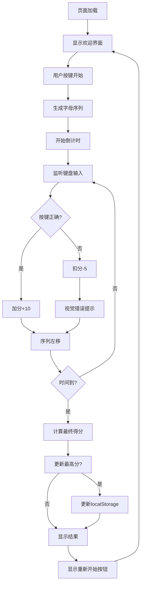

# 指尖飞舞 V1.0 - MVP版本需求规格说明书

## 项目概述

### 产品定位
针对8岁儿童的**单机版英文打字练习工具**，目标是通过简洁高效的练习模式，帮助小朋友提升打字准确率和速度。

### V1.0 版本边界
- ✅ **包含**：核心打字练习 + 基础计分 + 历史最高分
- ❌ **不包含**：注册登录、复杂统计、多用户、云端存储

### 设计目标
- **核心目标**：专注打字练习，零学习成本
- **性能目标**：键盘响应 < 30ms，界面简洁流畅
- **激励目标**：历史最高分驱动持续练习
- **扩展目标**：V1.0支持英语，预留多语种扩展架构

### 多语种扩展规划

#### V1.0 支持语言
- ✅ **英语 (English)** - 26个小写字母 (a-z)

#### 未来扩展支持 (V2.0+)
- 🌟 **中文拼音** - 声母+韵母组合
- 🌟 **日语假名** - ひらがな + カタカナ
- 🌟 **韩语** - 한글
- 🌟 **法语** - 26字母 + 重音符
- 🌟 **德语** - 26字母 + ä, ö, ü, ß
- 🌟 **西班牙语** - 27字母 (包含 ñ)
- 🌟 **俄语** -西里尔字母
- 🌟 **阿拉伯语** -阿拉伯字母 (RTL)

#### 扩展架构设计
- **语言抽象层** - 统一的语言接口
- **动态字符集** - 可配置字符集
- **键盘布局适配** - 支持不同键盘映射
- **字体支持** - Unicode字体兼容
- **输入法兼容** - 支持IME输入

---

## 1. 功能规格 (V1.0 MVP)

### 1.1 核心功能清单

| 功能 | 优先级 | 说明 |
|------|-------|------|
| 打字练习 | P0 | 字母序列输入练习 |
| 实时计分 | P0 | 正确加分、错误扣分 |
| 倒计时 | P0 | 2分钟固定时长 |
| 视觉反馈 | P0 | 正确/错误即时提示 |
| 历史最高分 | P0 | 本地存储一个最高分 |
| 重新开始 | P0 | 快速重启练习 |
| 大小写配置 | P0 | 支持区分/忽略大小写 |
| 虚拟键盘显示 | P0 | **显示完整键盘布局，帮助小朋友熟悉键位** |
| 当前键位高亮 | P0 | **高亮当前应按的键位，引导小朋友操作** |
| 音效提示 | P1 | 正确/错误音效 |

### 1.2 暂缓功能 (未来版本)

| 功能 | 版本 | 说明 |
|------|------|------|
| 多种练习模式 | V2.0 | 仅保留默认模式 |
| 自定义时长 | V2.0 | 固定2分钟 |
| 数据统计 | V2.0 | 仅保留最高分 |
| 单词练习 | V2.0 | 仅随机字母 |
| 导入文本 | V2.0 | 支持.txt文件导入生成字母序列 |
| 进度追踪 | V3.0 | 暂不需要 |

---

## 2. 系统架构 (简化版)

### 2.1 技术栈
```
前端框架：Vue 3 (Composition API)
开发语言：TypeScript
构建工具：Vite
状态管理：Pinia (Vue 3官方推荐)
样式方案：Sass/SCSS
存储：localStorage (仅存储最高分)
音频：Web Audio API 或 HTML5 Audio
```

### 2.2 文件结构 (Vue3 + TypeScript项目)
```
project-root/
├── index.html              # 主页面
├── vite.config.ts          # Vite配置
├── tsconfig.json           # TypeScript配置
├── package.json            # 依赖管理
├── src/
│   ├── main.ts            # 应用入口
│   ├── App.vue            # 根组件
│   ├── assets/            # 静态资源
│   │   ├── styles/        # 全局样式
│   │   │   └── main.scss
│   │   └── sounds/        # 音效文件
│   │       ├── correct.mp3
│   │       └── wrong.mp3
│   ├── components/        # Vue组件
│   │   ├── GameBoard.vue  # 游戏主面板
│   │   ├── ScoreBoard.vue # 分数显示
│   │   ├── Timer.vue      # 倒计时
│   │   ├── SequenceView.vue # 字母序列
│   │   ├── VirtualKeyboard.vue # 虚拟键盘
│   │   └── ConfigPanel.vue # 配置面板
│   ├── composables/       # 组合式函数
│   │   ├── useGame.ts     # 游戏逻辑
│   │   ├── useKeyboard.ts # 键盘处理
│   │   ├── useScore.ts    # 计分系统
│   │   └── useStorage.ts  # 本地存储
│   ├── types/             # TypeScript类型定义
│   │   └── index.ts
│   ├── utils/             # 工具函数
│   │   └── helpers.ts
│   └── language/          # 多语种模块 (V1.0预留)
│       ├── LanguageManager.ts
│       ├── configs/
│       │   └── english.ts
│       └── index.ts
└── public/                # 公共资源
```

### 2.3 核心模块

```javascript
// 模块职责
Game          // 游戏主控制器
├── init()        // 初始化
├── start()       // 开始游戏
├── handleKey()   // 处理按键
└── end()         // 结束游戏

Keyboard       // 键盘处理
├── listen()      // 监听键盘
├── validate()    // 验证按键
└── getKey()      // 获取按键

Score          // 计分系统
├── add()         // 加分
├── subtract()    // 扣分
├── getTotal()    // 获取总分
└── updateHigh()  // 更新最高分

Storage        // 本地存储
├── getHighScore()   // 获取最高分
├── setHighScore()   // 设置最高分
└── save()           // 保存数据

Language       // 语言管理 (V1.0预留)
├── getConfig()      // 获取语言配置
├── generateChars()  // 生成字符序列
├── validateKey()    // 验证按键
└── getKeyboardLayout() // 获取键盘布局
```

### 2.4 多语种扩展架构 (LanguageManager)

#### 语言配置数据结构
```javascript
// 语言配置 (languageConfig.js)
const LANGUAGE_CONFIGS = {
  english: {
    code: 'en',
    name: 'English',
    nativeName: 'English',
    characters: 'abcdefghijklmnopqrstuvwxyz',
    keyboardLayout: 'qwertyuiopasdfghjklzxcvbnm',
    fontFamily: 'Arial, sans-serif',
    textDirection: 'ltr',  // left-to-right
    wordBoundary: /[a-z]/,
    caseSensitive: false
  },
  // V2.0+ 扩展配置示例
  chinese: {
    code: 'zh',
    name: 'Chinese Pinyin',
    nativeName: '中文拼音',
    characters: 'abcdefghijklmnopqrstuvwxyz', // 实际使用时扩展为拼音
    pinyinSyllables: ['ba', 'ma', 'da', ...], // 声母韵母组合
    fontFamily: '"Microsoft YaHei", "PingFang SC", Arial, sans-serif',
    textDirection: 'ltr'
  },
  japanese: {
    code: 'ja',
    name: 'Japanese Kana',
    nativeName: '日本語 (かな)',
    hiragana: 'ひらがな',
    katakana: 'カタカナ',
    characters: 'あいうえおかきくけこさしすせそたちつてとなにぬねのはひふへほまみむめもやゆよらりるれろわをん',
    fontFamily: '"Noto Sans CJK JP", "Hiragino Sans", Arial, sans-serif',
    textDirection: 'ltr'
  }
};
```

#### LanguageManager类设计
```javascript
/**
 * 语言管理器 - 统一管理多语种支持
 * V1.0: 仅支持英语
 * V2.0+: 支持动态切换语言
 */
class LanguageManager {
  constructor(languageCode = 'english') {
    this.currentLanguage = LANGUAGE_CONFIGS[languageCode];
    this.charPool = this.currentLanguage.characters.split('');
  }

  // 获取当前语言配置
  getCurrentLanguage() {
    return this.currentLanguage;
  }

  // 切换语言 (V2.0功能)
  switchLanguage(languageCode) {
    if (LANGUAGE_CONFIGS[languageCode]) {
      this.currentLanguage = LANGUAGE_CONFIGS[languageCode];
      this.charPool = this.currentLanguage.characters.split('');
      return true;
    }
    return false;
  }

  // 生成字符序列 (多语种通用)
  generateSequence(length = 50) {
    const sequence = [];
    let lastChar = '';

    for (let i = 0; i < length; i++) {
      let char;
      let attempts = 0;

      // 避免连续重复 (根据语言特性调整)
      do {
        const randomIndex = Math.floor(Math.random() * this.charPool.length);
        char = this.charPool[randomIndex];
        attempts++;
      } while (
        attempts < 5 &&
        this.shouldAvoidRepetition(char, lastChar, this.currentLanguage)
      );

      sequence.push(char);
      lastChar = char;
    }

    return sequence;
  }

  // 判断是否应避免重复 (可针对不同语言定制)
  shouldAvoidRepetition(current, last, languageConfig) {
    // 英语: 避免连续3个相同字符
    if (languageConfig.code === 'english') {
      return current === last || current === last.repeat(2);
    }

    // 其他语言可定制规则
    return current === last;
  }

  // 验证按键 (多语种通用)
  validateKey(pressedKey, expectedChar) {
    // 转换为小写比较 (英语默认)
    const normalizedKey = this.normalizeKey(pressedKey);

    // 根据语言配置决定是否区分大小写
    if (!this.currentLanguage.caseSensitive) {
      return normalizedKey === expectedChar.toLowerCase();
    }

    return normalizedKey === expectedChar;
  }

  // 标准化按键 (处理不同键盘布局)
  normalizeKey(key) {
    // 英语直接返回小写
    return key.toLowerCase();
  }

  // 获取键盘布局 (用于虚拟键盘显示)
  getKeyboardLayout() {
    return this.currentLanguage.keyboardLayout;
  }

  // 获取字体 (确保字符正确显示)
  getFontFamily() {
    return this.currentLanguage.fontFamily;
  }

  // 获取文本方向 (LTR/RTL)
  getTextDirection() {
    return this.currentLanguage.textDirection;
  }
}
```

### 2.5 文件结构更新 (支持多语种)

```
project-root/
├── index.html
├── css/
│   └── style.css
├── js/
│   ├── main.js
│   ├── game.js
│   ├── keyboard.js
│   ├── score.js
│   ├── storage.js
│   └── language/              # 多语种模块目录 (V1.0预留)
│       ├── languageManager.js # 语言管理器
│       ├── languageConfig.js  # 语言配置
│       └── english.js         # 英语模块 (V1.0实现)
├── data/                      # 语言数据 (V2.0添加)
│   ├── english-words.txt      # 英语单词
│   ├── pinyin-syllables.txt   # 拼音音节 (未来)
│   └── kana-table.txt         # 假名表 (未来)
└── fonts/                     # 多语种字体 (V2.0添加)
    ├── english-default.ttf
    ├── japanese-kana.ttf
    └── chinese-pinyin.ttf
```

---

## 3. 详细功能设计

### 3.1 界面布局

```
┌─────────────────────────────────────────┐
│  指尖飞舞  [Logo]          最高分: 850  │  ← 顶部：标题+最高分
├─────────────────────────────────────────┤
│                                         │
│              当前得分: 120              │  ← 分数显示
│              剩余时间: 01:23            │  ← 时间倒计时
│                                         │
│  a  s  d  f  g  h  j  k  l             │
│  ▲                                      │  ← 字母序列
│                                         │
│  ┌─┐ ┌─┐ ┌─┐ ┌─┐ ┌─┐ ┌─┐ ┌─┐ ┌─┐      │
│  │a│ │s│ │d│ │f│ │g│ │h│ │j│ │k│ ...   │  ← 虚拟键盘
│  └─┘ └─┘ └─┘ └─┘ └─┘ └─┘ └─┘ └─┘      │
│             ▲                          │  ← 当前按键高亮
│                                         │
├─────────────────────────────────────────┤
│         [重新开始] [音效: 开/关]         │  ← 底部：控制按钮
└─────────────────────────────────────────┘
```

### 3.2 交互流程



---

## 4. 数据模型

### 4.1 游戏状态 (GameState)
```typescript
// types/index.ts
export interface GameState {
  status: 'idle' | 'running' | 'finished';
  score: number;
  highScore: number;
  timeRemaining: number;   // 固定2分钟
  sequence: string[];      // 当前字母序列
  currentIndex: number;    // 当前应输入位置
  correctCount: number;    // 正确次数
  wrongCount: number;      // 错误次数
  soundEnabled: boolean;   // 音效开关
  // 大小写配置 (V1.0新增)
  caseSensitive: boolean;  // 是否区分大小写
  // 多语种支持字段
  currentLanguage: 'english';  // 当前语言 (V1.0固定英语)
  languageManager: LanguageManager | null;  // 语言管理器实例
  fontFamily: string;      // 当前字体
}

export interface GameConfig {
  duration: number;        // 游戏时长（秒）
  scoreCorrect: number;    // 正确得分
  scoreWrong: number;      // 错误扣分
  sequenceLength: number;  // 序列显示长度
  caseSensitive: boolean;  // 大小写配置 (V1.0)
  defaultLanguage: 'english'; // 默认语言
  supportedLanguages: string[]; // 支持的语言列表
}
```

### 4.2 配置常量
```typescript
// utils/config.ts
export const GAME_CONFIG: GameConfig = {
  duration: 120,
  scoreCorrect: 10,
  scoreWrong: -5,
  sequenceLength: 50,
  caseSensitive: false,  // 默认忽略大小写 (V1.0新增)
  defaultLanguage: 'english',
  supportedLanguages: ['english']
};
```

---

## 5. 核心算法实现

### 5.1 字母序列生成 (基于LanguageManager)

#### V1.0 实现 (英语)
```typescript
// utils/sequenceGenerator.ts

/**
 * 生成随机字母序列 (V1.0 - 英语专用，支持大小写)
 * @param length - 序列长度
 * @param caseSensitive - 是否区分大小写
 * @returns 字母序列
 */
export function generateSequence(
  length: number = GAME_CONFIG.sequenceLength,
  caseSensitive: boolean = GAME_CONFIG.caseSensitive
): string[] {
  const sequence: string[] = [];
  let lastChar: string = '';

  for (let i = 0; i < length; i++) {
    let char: string;
    let attempts = 0;

    // 生成随机字母
    const asciiCode = 97 + Math.floor(Math.random() * 26); // 'a' (97) 到 'z' (122)
    char = String.fromCharCode(asciiCode);

    // 50% 概率生成大写字母 (如果区分大小写)
    if (caseSensitive && Math.random() > 0.5) {
      char = char.toUpperCase();
    }

    // 避免连续3个相同字符
    do {
      attempts++;
    } while (
      attempts < 5 &&
      (char === lastChar || char === lastChar.repeat(2))
    );

    sequence.push(char);
    lastChar = char;
  }

  return sequence;
}

/**
 * 标准化字符比较 (支持大小写配置)
 * @param key - 按键字符
 * @param expected - 期望字符
 * @param caseSensitive - 是否区分大小写
 * @returns 比较结果
 */
export function compareChars(
  key: string,
  expected: string,
  caseSensitive: boolean = GAME_CONFIG.caseSensitive
): boolean {
  if (caseSensitive) {
    return key === expected;
  } else {
    return key.toLowerCase() === expected.toLowerCase();
  }
}
```

#### V2.0+ 通用实现 (多语种)
```javascript
/**
 * 使用LanguageManager生成字符序列 (V2.0+)
 * @param {LanguageManager} languageManager - 语言管理器
 * @param {number} length - 序列长度
 * @returns {string[]} 字符序列
 */
function generateSequenceUniversal(languageManager, length = CONFIG.SEQUENCE_LENGTH) {
  return languageManager.generateSequence(length);
}
```

### 5.2 多语种扩展示例

#### 中文拼音扩展 (V2.0)
```javascript
// 中文拼音语言配置
const CHINESE_CONFIG = {
  code: 'zh',
  name: 'Chinese Pinyin',
  nativeName: '中文拼音',
  // 声母 (Initial consonants)
  initials: ['b', 'p', 'm', 'f', 'd', 't', 'n', 'l', 'g', 'k', 'h', 'j', 'q', 'x', 'zh', 'ch', 'sh', 'r', 'z', 'c', 's', 'y', 'w'],
  // 韵母 (Finals)
  finals: ['a', 'o', 'e', 'i', 'u', 'ü', 'ai', 'ei', 'ui', 'ao', 'ou', 'iu', 'ie', 'üe', 'er', 'an', 'en', 'in', 'un', 'ün', 'ang', 'eng', 'ing', 'ong'],
  // 生成拼音音节
  generateSyllable() {
    const initial = this.initials[Math.floor(Math.random() * this.initials.length)];
    const final = this.finals[Math.floor(Math.random() * this.finals.length)];
    return initial + final;
  },
  fontFamily: '"Microsoft YaHei", "PingFang SC", Arial, sans-serif',
  textDirection: 'ltr'
};

// 扩展LanguageManager支持拼音
LanguageManager.prototype.generatePinyinSequence = function(length = 50) {
  const sequence = [];
  for (let i = 0; i < length; i++) {
    sequence.push(CHINESE_CONFIG.generateSyllable());
  }
  return sequence;
};
```

#### 日语假名扩展 (V2.0)
```javascript
// 日语假名配置
const JAPANESE_CONFIG = {
  code: 'ja',
  name: 'Japanese Kana',
  nativeName: '日本語 (かな)',
  // 平假名
  hiragana: 'あいうえおかきくけこさしすせそたちつてとなにぬねのはひふへほまみむめもやゆよらりるれろわをん',
  // 片假名
  katakana: 'アイウエオカキクケコサシスセソタチツテトナニヌネノハヒフヘホマミムメモヤユヨラリルレロヲン',
  // 随机生成假名
  generateKana() {
    const useHiragana = Math.random() > 0.5;
    const chars = useHiragana ? this.hiragana : this.katakana;
    return chars[Math.floor(Math.random() * chars.length)];
  },
  fontFamily: '"Noto Sans CJK JP", "Hiragino Sans", Arial, sans-serif',
  textDirection: 'ltr'
};
```

### 5.3 语言切换实现 (V2.0)

```javascript
/**
 * 动态切换语言
 * @param {string} languageCode - 语言代码
 */
function switchLanguage(languageCode) {
  if (!CONFIG.SUPPORTED_LANGUAGES.includes(languageCode)) {
    console.warn(`Language ${languageCode} is not supported yet`);
    return false;
  }

  // 保存当前状态
  const currentScore = game.state.score;
  const currentTime = game.state.timeRemaining;

  // 切换语言管理器
  game.state.languageManager = new LanguageManager(languageCode);
  game.state.currentLanguage = languageCode;
  game.state.fontFamily = game.state.languageManager.getFontFamily();

  // 更新UI字体和布局
  updateUIFont(game.state.fontFamily);
  updateKeyboardLayout(game.state.languageManager.getKeyboardLayout());

  // 重新生成序列
  game.generateSequence();

  console.log(`Language switched to: ${languageCode}`);
  return true;
}
```

### 5.2 计分算法
```javascript
/**
 * 计分系统
 */
class ScoreManager {
  constructor() {
    this.score = 0;
    this.highScore = this.loadHighScore();
  }

  // 正确加分
  add() {
    this.score += CONFIG.SCORE_CORRECT;
    this.updateDisplay();
    this.checkHighScore();
  }

  // 错误扣分
  subtract() {
    this.score += CONFIG.SCORE_WRONG;
    this.score = Math.max(0, this.score); // 最低0分
    this.updateDisplay();
  }

  // 检查是否创造新记录
  checkHighScore() {
    if (this.score > this.highScore) {
      this.highScore = this.score;
      this.saveHighScore();
      this.showNewRecordEffect();
    }
  }

  // 从localStorage加载最高分
  loadHighScore() {
    return parseInt(localStorage.getItem('typingHighScore')) || 0;
  }

  // 保存最高分到localStorage
  saveHighScore() {
    localStorage.setItem('typingHighScore', this.highScore.toString());
  }

  // 重置得分
  reset() {
    this.score = 0;
    this.updateDisplay();
  }
}
```

### 5.3 键盘处理
```javascript
/**
 * 键盘处理
 */
class KeyboardHandler {
  constructor(game) {
    this.game = game;
    this.isListening = false;
  }

  // 开始监听
  start() {
    this.isListening = true;
    document.addEventListener('keydown', this.handleKeyDown.bind(this));
  }

  // 停止监听
  stop() {
    this.isListening = false;
    document.removeEventListener('keydown', this.handleKeyDown.bind(this));
  }

  // 处理按键
  handleKeyDown(event) {
    if (!this.isListening || this.game.state.status !== 'running') {
      return;
    }

    // 只处理字母键
    if (event.key.length === 1 && event.key >= 'a' && event.key <= 'z') {
      this.game.processInput(event.key);
      event.preventDefault();
    }
  }
}
```

---

## 6. 视觉反馈设计

### 6.1 CSS动画

#### 正确反馈
```css
/* 正确输入 - 字母变绿闪一下 */
@keyframes correctFlash {
  0% { background-color: #7ED321; color: white; }
  100% { background-color: transparent; color: inherit; }
}

.letter-correct {
  animation: correctFlash 0.3s ease;
}

/* 当前字母高亮 */
.letter-current {
  background-color: #FFD93D;
  border: 2px solid #F5A623;
  padding: 2px 6px;
  border-radius: 4px;
}
```

#### 错误反馈
```css
/* 错误输入 - 背景红闪 + 轻微震动 */
@keyframes wrongFlash {
  0%, 100% { transform: translateX(0); }
  25% { transform: translateX(-5px); }
  75% { transform: translateX(5px); }
}

.wrong-feedback {
  animation: wrongFlash 0.2s ease;
}

/* 整个游戏区域闪烁 */
@keyframes errorShake {
  0%, 100% { background-color: transparent; }
  50% { background-color: rgba(208, 2, 27, 0.1); }
}

.game-area-error {
  animation: errorShake 0.15s ease;
}
```

### 6.2 虚拟键盘高亮
```css
.virtual-keyboard {
  display: grid;
  grid-template-columns: repeat(10, 1fr);
  gap: 8px;
  margin: 20px 0;
}

.key {
  padding: 10px;
  background: #E8E8E8;
  border-radius: 4px;
  text-align: center;
  font-weight: bold;
}

.key-current {
  background: #F5A623;
  color: white;
  transform: scale(1.1);
  box-shadow: 0 0 10px rgba(245, 166, 35, 0.6);
  transition: all 0.2s ease;
}
```

---

## 7. 音效系统 (简化版)

### 7.1 音效文件
- `correct.mp3`: 正确音效 (清脆"叮"声)
- `wrong.mp3`: 错误音效 (低沉"咚"声)

### 7.2 音效播放
```javascript
class AudioManager {
  constructor() {
    this.enabled = true;
    this.sounds = {
      correct: new Audio('sounds/correct.mp3'),
      wrong: new Audio('sounds/wrong.mp3')
    };

    // 设置音量
    this.sounds.correct.volume = 0.3;
    this.sounds.wrong.volume = 0.3;
  }

  playCorrect() {
    if (this.enabled) {
      this.sounds.correct.currentTime = 0;
      this.sounds.correct.play().catch(() => {
        // 播放失败静默处理
      });
    }
  }

  playWrong() {
    if (this.enabled) {
      this.sounds.wrong.currentTime = 0;
      this.sounds.wrong.play().catch(() => {
        // 播放失败静默处理
      });
    }
  }

  toggle() {
    this.enabled = !this.enabled;
    return this.enabled;
  }
}
```

---

## 8. 完整游戏逻辑

### 8.1 主游戏类
```javascript
class TypingGame {
  constructor() {
    this.state = new GameState();
    this.scoreManager = new ScoreManager();
    this.keyboard = new KeyboardHandler(this);
    this.audio = new AudioManager();
    this.timer = null;

    this.init();
  }

  // 初始化
  init() {
    this.generateSequence();
    this.updateDisplay();
    this.attachEventListeners();
  }

  // 生成新序列
  generateSequence() {
    this.state.sequence = generateSequence();
    this.state.currentIndex = 0;
  }

  // 开始游戏
  start() {
    if (this.state.status === 'running') return;

    this.state.status = 'running';
    this.state.timeRemaining = CONFIG.GAME_DURATION;
    this.scoreManager.reset();
    this.generateSequence();

    // 开始倒计时
    this.startTimer();

    // 开始监听键盘
    this.keyboard.start();

    this.updateDisplay();
  }

  // 处理用户输入
  processInput(char) {
    const expected = this.state.sequence[this.state.currentIndex];

    if (char === expected) {
      // 正确
      this.state.correctCount++;
      this.scoreManager.add();
      this.audio.playCorrect();
      this.highlightCorrect();

      // 序列左移
      this.state.sequence.shift();
      this.state.sequence.push(this.getRandomChar());
      this.state.currentIndex = 0;

    } else {
      // 错误
      this.state.wrongCount++;
      this.scoreManager.subtract();
      this.audio.playWrong();
      this.highlightWrong();
    }

    this.updateDisplay();
  }

  // 定时器
  startTimer() {
    this.timer = setInterval(() => {
      this.state.timeRemaining--;

      if (this.state.timeRemaining <= 0) {
        this.end();
      }

      this.updateTimeDisplay();
    }, 1000);
  }

  // 结束游戏
  end() {
    this.state.status = 'finished';
    clearInterval(this.timer);
    this.keyboard.stop();

    this.showResult();
  }

  // 显示结果
  showResult() {
    const isNewRecord = this.scoreManager.score > this.scoreManager.highScore;

    const resultHTML = `
      <div class="result-modal">
        <h2>练习完成！</h2>
        <p>本次得分: <strong>${this.scoreManager.score}</strong></p>
        <p>历史最高: <strong>${this.scoreManager.highScore}</strong></p>
        ${isNewRecord ? '<p class="new-record">🎉 新纪录！</p>' : ''}
        <button onclick="game.restart()">再来一次</button>
      </div>
    `;

    document.getElementById('result').innerHTML = resultHTML;
    document.getElementById('result').style.display = 'block';
  }

  // 重新开始
  restart() {
    document.getElementById('result').style.display = 'none';
    this.start();
  }

  // 生成随机字符
  getRandomChar() {
    return String.fromCharCode(
      CONFIG.MIN_ASCII + Math.floor(Math.random() * 26)
    );
  }

  // 更新显示
  updateDisplay() {
    // 更新分数
    document.getElementById('score').textContent = this.scoreManager.score;
    document.getElementById('highScore').textContent = this.scoreManager.highScore;

    // 更新序列
    this.renderSequence();

    // 更新虚拟键盘
    this.renderKeyboard();
  }

  // 渲染字母序列
  renderSequence() {
    const seq = this.state.sequence;
    const html = seq.map((char, index) => {
      const className = index === 0 ? 'letter-current' : 'letter';
      return `<span class="${className}">${char}</span>`;
    }).join(' ');

    document.getElementById('sequence').innerHTML = html;
  }

  // 渲染虚拟键盘
  renderKeyboard() {
    const currentChar = this.state.sequence[0];
    const html = 'qwertyuiopasdfghjklzxcvbnm'.split('').map(char => {
      const className = char === currentChar ? 'key key-current' : 'key';
      return `<div class="${className}">${char}</div>`;
    }).join('');

    document.getElementById('keyboard').innerHTML = html;
  }

  // 更新倒计时显示
  updateTimeDisplay() {
    const minutes = Math.floor(this.state.timeRemaining / 60);
    const seconds = this.state.timeRemaining % 60;
    const timeText = `${minutes.toString().padStart(2, '0')}:${seconds.toString().padStart(2, '0')}`;
    document.getElementById('time').textContent = timeText;
  }

  // 正确反馈
  highlightCorrect() {
    const current = document.querySelector('.letter-current');
    if (current) {
      current.classList.add('letter-correct');
      setTimeout(() => current.classList.remove('letter-correct'), 300);
    }
  }

  // 错误反馈
  highlightWrong() {
    const gameArea = document.querySelector('.game-area');
    gameArea.classList.add('game-area-error');
    setTimeout(() => gameArea.classList.remove('game-area-error'), 150);
  }
}
```

---

## 9. HTML结构

### 9.1 index.html
```html
<!DOCTYPE html>
<html lang="zh-CN">
<head>
  <meta charset="UTF-8">
  <meta name="viewport" content="width=device-width, initial-scale=1.0">
  <title>指尖飞舞 - 儿童打字练习</title>
  <link rel="stylesheet" href="css/style.css">
</head>
<body>
  <div class="container">
    <!-- 顶部 -->
    <header>
      <h1>🌸 指尖飞舞</h1>
      <div class="stats">
        <span>最高分: <strong id="highScore">0</strong></span>
      </div>
    </header>

    <!-- 游戏区域 -->
    <main class="game-area">
      <!-- 分数和时间 -->
      <div class="info-panel">
        <div class="info-item">
          <label>当前得分</label>
          <div class="value" id="score">0</div>
        </div>
        <div class="info-item">
          <label>剩余时间</label>
          <div class="value" id="time">02:00</div>
        </div>
      </div>

      <!-- 字母序列 -->
      <div class="sequence-container">
        <div class="sequence" id="sequence">
          <!-- 动态生成 -->
        </div>
      </div>

      <!-- 虚拟键盘 -->
      <div class="virtual-keyboard" id="keyboard">
        <!-- 动态生成 -->
      </div>

      <!-- 控制按钮 -->
      <div class="controls">
        <button id="startBtn" class="btn-primary">开始练习</button>
        <button id="restartBtn" class="btn-secondary">重新开始</button>
        <button id="soundBtn" class="btn-toggle">音效: 开</button>
      </div>
    </main>

    <!-- 结果弹窗 -->
    <div id="result" class="modal" style="display: none;">
      <!-- 动态生成 -->
    </div>
  </div>

  <script src="js/storage.js"></script>
  <js/score.js"></script>
  <script src="js/keyboard.js"></script>
  <script src="js/game.js"></script>
  <script src="js/main.js"></script>
</body>
</html>
```

---

## 10. CSS样式 (style.css)

### 10.1 基础样式
```css
/* 全局 */
* {
  margin: 0;
  padding: 0;
  box-sizing: border-box;
}

body {
  font-family: 'Segoe UI', Arial, sans-serif;
  background: linear-gradient(135deg, #667eea 0%, #764ba2 100%);
  min-height: 100vh;
  display: flex;
  justify-content: center;
  align-items: center;
  padding: 20px;
}

.container {
  background: white;
  border-radius: 20px;
  box-shadow: 0 20px 60px rgba(0, 0, 0, 0.3);
  width: 100%;
  max-width: 900px;
  padding: 30px;
}

/* 顶部 */
header {
  display: flex;
  justify-content: space-between;
  align-items: center;
  margin-bottom: 30px;
  padding-bottom: 20px;
  border-bottom: 2px solid #E8E8E8;
}

h1 {
  font-size: 2.5em;
  color: #4A90E2;
}

.stats span {
  font-size: 1.2em;
  color: #666;
}

.stats strong {
  color: #F5A623;
  font-size: 1.4em;
}

/* 游戏区域 */
.game-area {
  text-align: center;
}

.info-panel {
  display: flex;
  justify-content: space-around;
  margin-bottom: 30px;
}

.info-item label {
  display: block;
  color: #666;
  font-size: 0.9em;
  margin-bottom: 8px;
}

.info-item .value {
  font-size: 2.5em;
  font-weight: bold;
  color: #4A90E2;
}

/* 字母序列 */
.sequence-container {
  background: #F5F7FA;
  padding: 30px;
  border-radius: 10px;
  margin: 20px 0;
  min-height: 80px;
}

.sequence {
  font-size: 2em;
  letter-spacing: 8px;
  display: flex;
  justify-content: center;
  flex-wrap: wrap;
  gap: 8px;
}

.letter {
  display: inline-block;
  padding: 4px 8px;
  transition: all 0.2s ease;
}

.letter-current {
  background: #FFD93D;
  border-radius: 4px;
  animation: pulse 1s infinite;
}

@keyframes pulse {
  0%, 100% { transform: scale(1); }
  50% { transform: scale(1.1); }
}

/* 虚拟键盘 */
.virtual-keyboard {
  display: grid;
  grid-template-columns: repeat(10, 1fr);
  gap: 8px;
  margin: 30px 0;
}

.key {
  padding: 15px;
  background: #E8E8E8;
  border-radius: 8px;
  font-weight: bold;
  font-size: 1.2em;
  transition: all 0.2s ease;
}

.key-current {
  background: #F5A623;
  color: white;
  transform: scale(1.15);
  box-shadow: 0 5px 15px rgba(245, 166, 35, 0.5);
}

/* 按钮 */
.controls {
  margin-top: 30px;
  display: flex;
  gap: 15px;
  justify-content: center;
  flex-wrap: wrap;
}

button {
  padding: 12px 30px;
  border: none;
  border-radius: 25px;
  font-size: 1em;
  font-weight: bold;
  cursor: pointer;
  transition: all 0.3s ease;
}

.btn-primary {
  background: #4A90E2;
  color: white;
}

.btn-primary:hover {
  background: #357ABD;
  transform: translateY(-2px);
  box-shadow: 0 5px 15px rgba(74, 144, 226, 0.4);
}

.btn-secondary {
  background: #7ED321;
  color: white;
}

.btn-secondary:hover {
  background: #6BB91C;
}

.btn-toggle {
  background: #E8E8E8;
  color: #666;
}

.btn-toggle:hover {
  background: #D0D0D0;
}

/* 结果弹窗 */
.modal {
  position: fixed;
  top: 0;
  left: 0;
  width: 100%;
  height: 100%;
  background: rgba(0, 0, 0, 0.5);
  display: flex;
  justify-content: center;
  align-items: center;
  z-index: 1000;
}

.result-modal {
  background: white;
  padding: 40px;
  border-radius: 15px;
  text-align: center;
  max-width: 400px;
}

.result-modal h2 {
  color: #4A90E2;
  margin-bottom: 20px;
}

.result-modal p {
  font-size: 1.2em;
  margin: 10px 0;
}

.result-modal strong {
  color: #F5A623;
  font-size: 1.5em;
}

.new-record {
  color: #7ED321;
  font-size: 1.5em !important;
  animation: bounce 0.5s infinite;
}

@keyframes bounce {
  0%, 100% { transform: translateY(0); }
  50% { transform: translateY(-10px); }
}

/* 响应式 */
@media (max-width: 768px) {
  .container {
    padding: 20px;
  }

  h1 {
    font-size: 2em;
  }

  .sequence {
    font-size: 1.5em;
  }

  .virtual-keyboard {
    grid-template-columns: repeat(7, 1fr);
  }
}
```

---

## 11. 主入口文件 (main.js)

```javascript
// 全局游戏实例
let game;

// DOM加载完成后初始化
document.addEventListener('DOMContentLoaded', () => {
  // 创建游戏实例
  game = new TypingGame();

  // 绑定按钮事件
  document.getElementById('startBtn').addEventListener('click', () => {
    game.start();
  });

  document.getElementById('restartBtn').addEventListener('click', () => {
    game.restart();
  });

  document.getElementById('soundBtn').addEventListener('click', (e) => {
    const enabled = game.audio.toggle();
    e.target.textContent = `音效: ${enabled ? '开' : '关'}`;
  });

  // 首次访问显示欢迎信息
  showWelcome();
});

// 显示欢迎信息
function showWelcome() {
  const welcome = `
    <div class="modal" style="display: flex;">
      <div class="result-modal">
        <h2>欢迎来到指尖飞舞！🌸</h2>
        <p>按任意字母键开始练习</p>
        <p style="font-size: 0.9em; color: #666; margin-top: 20px;">
          在2分钟内尽可能多地输入正确字母<br>
          正确: +10分 | 错误: -5分
        </p>
        <button onclick="this.closest('.modal').style.display='none'">
          开始练习
        </button>
      </div>
    </div>
  `;

  document.getElementById('result').innerHTML = welcome;
}
```

---

## 12. 开发计划

### 12.1 开发任务清单

| 任务 | 优先级 | 预估工时 | 负责人 |
|------|-------|---------|--------|
| 创建项目结构 | P0 | 0.5天 | - |
| 实现HTML结构 | P0 | 0.5天 | - |
| 实现CSS样式 | P0 | 1天 | - |
| 实现字母生成 | P0 | 0.5天 | - |
| 实现键盘处理 | P0 | 1天 | - |
| 实现计分系统 | P0 | 0.5天 | - |
| 实现本地存储 | P0 | 0.5天 | - |
| 实现计时器 | P0 | 0.5天 | - |
| 添加音效 | P1 | 0.5天 | - |
| 整体测试优化 | P0 | 1天 | - |
| **总计** | - | **6天** | - |

### 12.2 里程碑

- **Day 1**: 项目搭建 + 基础界面
- **Day 2**: 核心逻辑实现
- **Day 3**: 键盘交互 + 计分
- **Day 4**: 视觉效果优化
- **Day 5**: 音效 + 本地存储
- **Day 6**: 测试 + 发布

---

## 13. 测试用例

### 13.1 功能测试

#### 测试用例1: 基础打字流程
```
步骤:
1. 打开页面
2. 按下任意字母键
3. 观察字母序列生成
4. 按正确字母
5. 观察加分和序列变化

期望结果:
- 游戏开始倒计时
- 正确按键+10分
- 序列正确左移
```

#### 测试用例2: 错误处理
```
步骤:
1. 游戏进行中
2. 按错误的字母

期望结果:
- 扣5分 (最低0分)
- 背景闪烁红色
- 播放错误音效
```

#### 测试用例3: 最高分更新
```
步骤:
1. 创造一个高分
2. 游戏结束
3. 重新开始并超过之前分数

期望结果:
- 首次超过时显示"新纪录"
- 最高分持久化存储
- 页面刷新后最高分仍显示
```

### 13.2 性能测试

#### 测试用例4: 响应速度
```
工具: 手动测试
步骤:
快速连续按键 (10次/秒)
期望:
- 所有按键都被正确识别
- 无延迟或卡顿
```

### 13.3 兼容性测试

| 浏览器 | 版本 | 测试状态 |
|--------|------|----------|
| Chrome | 80+ | 待测试 |
| Firefox | 75+ | 待测试 |
| Safari | 13+ | 待测试 |
| Edge | 80+ | 待测试 |

---

## 14. 多语种扩展路线图

### 14.1 语言支持优先级

| 语言 | 版本 | 优先级 | 技术复杂度 | 用户需求量预估 |
|------|------|--------|------------|----------------|
| 🇺🇸 英语 | V1.0 | P0 | 低 | 高 |
| 🇨🇳 中文拼音 | V2.0 | P1 | 中 | 高 |
| 🇯🇵 日语(假名) | V2.0 | P1 | 中 | 中 |
| 🇰🇷 韩语 | V2.5 | P2 | 中 | 中 |
| 🇪🇸 西班牙语 | V2.5 | P2 | 低 | 中 |
| 🇫🇷 法语 | V3.0 | P2 | 低 | 中 |
| 🇩🇪 德语 | V3.0 | P2 | 低 | 低 |
| 🇷🇺 俄语 | V3.0 | P2 | 中 | 低 |
| 🇸🇦 阿拉伯语 | V4.0 | P3 | 高 | 低 |

### 14.2 V2.0 - 多语种启动版本

#### 新增语言
- [ ] **中文拼音**
  - 支持声母+韵母组合练习
  - 例如：ma, pa, di, gu, zheng 等
  - 字体：Microsoft YaHei
  - 键盘布局：适应拼音输入特点

- [ ] **日语假名**
  - 支持平假名(ひらがな)和片假名(カタカナ)
  - 46个基本假名字符
  - 字体：Noto Sans CJK JP
  - 可混合显示假名类型

#### 技术实现
- [ ] 实现LanguageManager完整功能
- [ ] 添加语言切换UI组件
- [ ] 适配不同字符集的键盘布局
- [ ] 实现Unicode字体回退机制
- [ ] 添加语言配置文件自动加载

#### 工作量预估
```
开发工时: 3-4周
├── 语言配置设计: 3天
├── 中文拼音实现: 5天
├── 日语假名实现: 5天
├── 键盘布局适配: 3天
├── 字体支持: 2天
└── 测试优化: 5天
```

### 14.3 V2.5 - 欧洲语言扩展

#### 新增语言
- [ ] **西班牙语**
  - 27字母 (包含 ñ)
  - 基础语法和常用单词
  - 重音符号支持 (á, é, í, ó, ú)

- [ ] **韩语(한글)**
  - 24个现代韩文字母
  - 音节组合规则
  - 字体：Noto Sans KR

#### 特点
- 拉丁字母系语言，架构通用
- 只需扩展字符集和字体
- 重音符号处理统一
- 可复用英语的键盘布局

### 14.4 V3.0 - 高级语言特性

#### 语言特性增强
- [ ] **字母频率优化**
  - 根据语言真实使用频率调整字符生成
  - 英语：e, t, a, o 出现频率更高
  - 中文：常用拼音组合优先级更高

- [ ] **词组模式**
  - 从单词列表生成练习序列
  - 英语：常用英文单词
  - 中文：常用词语组合
  - 日语：常用词汇

- [ ] **输入法支持**
  - 兼容系统输入法 (IME)
  - 支持全角/半角切换
  - 候选词显示优化

#### 技术优化
- [ ] Web Workers实现字符生成（避免UI阻塞）
- [ ] Service Worker实现语言包缓存
- [ ] 动态字体加载 (Font Face API)
- [ ] 语言包按需加载

### 14.5 V4.0 - 复杂脚本支持

#### 新增语言
- [ ] **阿拉伯语**
  - 从右到左(RTL)文字显示
  - 28个阿拉伯字母
  - 连写规则处理
  - 字体：Noto Naskh Arabic

- [ ] **希伯来语**
  - RTL文字支持
  - 22个希伯来字母
  - 混排处理 (希伯来语+英语)

#### 技术挑战
- **文字方向检测**
```javascript
const TEXT_DIRECTION = {
  ltr: ['english', 'chinese', 'japanese', 'korean', 'spanish'],
  rtl: ['arabic', 'hebrew', 'persian', 'urdu']
};

// 应用文字方向
function applyTextDirection(languageCode) {
  const direction = LANGUAGE_CONFIGS[languageCode].textDirection;
  document.documentElement.dir = direction;
  document.body.style.textAlign = direction === 'rtl' ? 'right' : 'left';
}
```

- **字体渲染**
  - 使用WOFF2格式字体（压缩率更高）
  - Font Display: Swap (避免FOIT)
  - 针对复杂脚本的字体回退链

### 14.6 多语种架构最佳实践

#### 1. 语言配置标准化
```javascript
// 统一语言配置接口
interface LanguageConfig {
  code: string;              // 语言代码 (ISO 639-1)
  name: string;              // 英文名称
  nativeName: string;        // 本地名称
  characters: string;        // 字符集
  keyboardLayout: string;    // 键盘布局
  fontFamily: string;        // 字体族
  textDirection: 'ltr' | 'rtl'; // 文字方向
  wordBoundary: RegExp;      // 单词边界检测
  caseSensitive: boolean;    // 是否区分大小写
  customRules?: object;      // 特殊规则
}
```

#### 2. 扩展性设计
- **插件化语言模块**
```javascript
// 语言模块注册
LanguageManager.registerLanguage('english', EnglishModule);
LanguageManager.registerLanguage('chinese', ChineseModule);
LanguageManager.registerLanguage('japanese', JapaneseModule);

// 动态加载语言包
async function loadLanguagePack(languageCode) {
  const module = await import(`./languages/${languageCode}.js`);
  LanguageManager.registerLanguage(languageCode, module.default);
}
```

#### 3. 本地化支持
```javascript
// UI文本多语种
const I18N = {
  en: {
    title: 'Fingertips Flying',
    score: 'Score',
    time: 'Time',
    start: 'Start Practice'
  },
  zh: {
    title: '指尖飞舞',
    score: '得分',
    time: '时间',
    start: '开始练习'
  },
  ja: {
    title: '指先飞舞',
    score: 'スコア',
    time: '時間',
    start: '練習開始'
  }
};
```

### 14.7 性能优化策略

#### 语言包体积
| 语言 | 字符集大小 | 字体大小(WOFF2) | 词汇数据 |
|------|------------|-----------------|----------|
| 英语 | 26字符 | ~30KB | 1MB(可选) |
| 中文拼音 | 拼音组合 | ~2MB(中文CJK) | 2MB(词汇) |
| 日语假名 | 46字符 | ~3MB(CJK) | 1.5MB(词汇) |
| 阿拉伯语 | 28字符 | ~500KB | 500KB(词汇) |

**优化方案**:
- 基础字体 + 增量字体 (可变字体)
- 语言包懒加载
- 词汇数据可选加载（单词模式下）

#### 渲染性能
- **大字符集优化**: 使用字符映射表代替字符串匹配
- **RTL布局**: 独立的布局计算逻辑
- **混合文字**: 复杂脚本混排优化

### 14.8 测试策略

#### 多语种测试清单
```
英语测试:
- 26字母输入正确性
- 大小写不敏感处理
- 键盘事件准确捕获

中文测试:
- 拼音音节组合正确性
- ü、üE等特殊字符显示
- 字体渲染正确性

日语测试:
- 平假名/片假名混合
- 小字体显示效果
- 假名宽度一致性

阿拉伯语测试:
- RTL布局正确性
- 字符连写渲染
- 与LTR文字混排
```

### 14.9 里程碑规划

| 版本 | 时间 | 语言支持 | 主要特性 | 工作量 |
|------|------|----------|----------|--------|
| V1.0 | Week 1-2 | 英语 | 基础打字练习 | 6天 |
| V2.0 | Week 7-10 | 英语+中文+日语 | 多语言切换、扩展字符集 | 4周 |
| V2.5 | Week 13-15 | +韩语+西语 | 欧洲语言扩展 | 3周 |
| V3.0 | Week 18-22 | +法语+德语+俄语 | 高级特性、词组模式 | 4周 |
| V4.0 | Week 25-28 | +阿拉伯语+希伯来语 | 复杂脚本、RTL支持 | 4周 |

**总计**: 约6个月完成8种语言支持

---

## 总结

V1.0 MVP版本专注于**最核心的打字练习功能**，特点：

✅ **极简设计** - 只有2分钟练习 + 基础计分 + 最高分
✅ **即时可用** - 打开即用，零配置
✅ **本地存储** - 仅需localStorage存最高分
✅ **流畅体验** - 纯前端实现，无需网络
✅ **易于迭代** - 模块化架构，便于扩展
✅ **多语种架构** - 预留LanguageManager，支持未来扩展8种语言

### V1.0 技术亮点

1. **LanguageManager架构**
   - 统一语言接口
   - 可插拔语言模块
   - 动态语言切换 (V2.0)
   - 完整的多语种扩展路径

2. **Unicode原生支持**
   - 16位字符支持
   - 多字符集适配 (26英文字母 → 46假名 → 28阿拉伯字母)
   - 字体回退机制

3. **文字方向支持**
   - LTR (left-to-right) - 英语、中文、日语等
   - RTL (right-to-left) - 阿拉伯语、希伯来语等
   - 自动方向检测

### 开发周期

| 版本 | 内容 | 工期 | 累计工期 |
|------|------|------|----------|
| V1.0 | 英语MVP | 6天 | 6天 |
| V2.0 | 中日双语 | 4周 | 5周 |
| V3.0 | 8种语言 | 4个月 | 6个月 |

快速验证英语市场 → 验证多语种需求 → 完整多语种产品

---

*文档版本: V1.0 MVP*
*最后更新: 2024-11-06*
*预计工期: 6天*
*多语种支持: 预留架构，未来6个月扩展8种语言*
*下一步: 开始编码实现*
